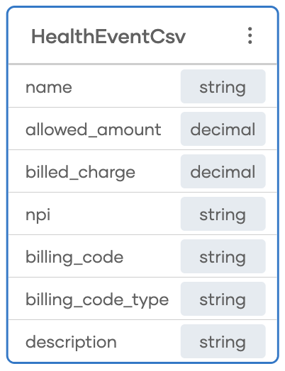

# Healthcare Pricing Extractor

Healthcare Pricing Extractor processes Machine-Readable Files (MRFs) published by health insurers under the CMS price transparency mandate. This tool extracts relevant pricing details (such as billing codes, allowed amounts, provider identifiers, and billed charges) into a clean, simplified format suitable for real-world analysis.

The extracted data is exported to a CSV file for easy access via Excel or BI tools, and optionally persisted into a database for reporting, compliance monitoring, or integration with downstream data pipelines.

### insert diagram

## Sample MRF files

Sample files with demo content is available in `demo-mrf-files` directory.

## Step-by-Step Guide

### 1. Define the types using one of the sample mrf files. 

- Create a new record `HealthEvent`
- Select to add the fields using `json` import option
- Paste sample mrf `demo-mrf-files/demo-out-1.json`
- Check both `is Closed` and `is Separate definitions` options

This will create a set of records.

### 2. Create a directory to listen in for the mrf files.

- incomingMRFPath: `mrf-files/incoming`

### 3. Add a new `file integration` artifact of type `Directory Service`

- Type:  Directory Service
- Listener name: `mrfListener`
- path: `incomingMRFPath`

We'll use the `onCreate` remote function that gets added by deafult.

### 4. Create a configurable variable to hold the directory path for incoming MRF files
- type `string` to hold `incomingMRFPath`
- default path: `./mrf-files/incoming`

Assign it as the path for the directory service.

### 5. Run the directory service and verify there are no errors

### 6. Develop the flow for the `onCreate` remote function as follows.

- Add an `Error Handler`
- Add a `log` statement on error with `Error occurred with reading json content from ${incomingMRFPath}`
- Add a function call to `io : fileReadJson` and use `event.name` as the json file path.
- Declare a variable `healthEvent` of type `HealthEvent|error` and assign the default value as `jsonResult.cloneWithType(HealthEvent)`
- Add an if condition for `healthEvent is error`
- If above condition is met Add a `log` statement on error with `Error occurred with parsing json content to type 'HealthEvent'`
- Add an else block to above condition

### 7. Add a new type `HealthEventCsv` to hold the csv content

- Create a simplified record to hold only some of the important data.



### 8. Create a function `processHealthEventMrf`

- input parameters:  type `HealthEvent` and `string` csvFileName
- output: error?

### 9. Create a data mapper function `mapOutNetworkItem`


### 9. Create a data mapper function `mapHealthEventToCsv`

- input : type `HealthEvent`
- output: type `HealthEventCsv[]`
- Add a query expression

```
from Out_of_networkItem item in healthEvent.out_of_network
    from Allowed_amountsItem allowedAmount in item.allowed_amounts
    from PaymentsItem paymentsItem in allowedAmount.payments
    from ProvidersItem provider in paymentsItem.providers
    select mapOutNetworkItem(item, paymentsItem.allowed_amount, provider.billed_charge, provider.npi.toString());
```

### 10. Create a function `getCsvFileName` to derive csvFileName from the mrf file name
 
- input: `string` mrf file name
- output: `string` csv file name

- declare and get variables for start and end index

startIndex: mrfFilePath.lastIndexOf("/") ?: 0
endIndex: mrfFilePath.length() - 5

- return csvFileName

```
mrfFilePath.substring(startIndex, lastIndex) + ".csv"
```

### 10. Design `processHealthEventMrf` function from step 8

- Call the data mapper `mapHealthEventToCsv`
- Call `io : fileWriteCsv` with the following inputs
    path: csvFileName (call `getCsvFileName` step 10 to get this)
    content: `HealthEventCsv[]`
